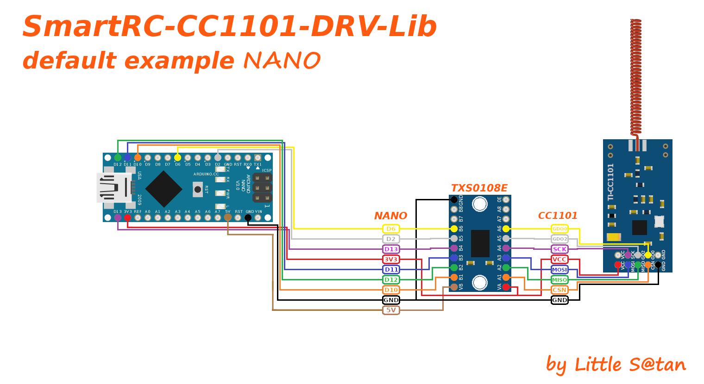

# pilight USB Nano CC1101

The pilight USB Nano software allows any computer with an USB port to work with pilight.

Pilight is a modular and open source solution to communicate with 433 MHz devices and runs on various small form factor computers.
A large number of wireless protocols of RC switches and weather stations using the 433/315Mhz radio frequency band via ASK/OOK pulse modulation are implemented by the excellent work of the "pilight" community. A list of supported protocols can be found in the pilight manual: https://manual.pilight.org/protocols/433.92/index.html

This example is based on @latchdevel fork of original "pilight-usb-nano" firmware, rewrite to fully Arduino environment compatible: https://github.com/latchdevel/pilight-usb-nano

Using Little_S@tan's Texas Instruments CC1101 SPI transceiver driver: https://github.com/LSatan/SmartRC-CC1101-Driver-Lib

It runs on any Arduino compatible platform: AVR, SAM/SAMD, ESP8266, ESP32, Teensy, even Raspberry Pico. Works using the MCU's internal USB-Serial COM port (CDC/ACM device class) or any onboard/external USB-Serial adapter.

# Wiring

The CC1101 SPI transceiver operates at 3.3v, not 5v tolerant. You must use a level shifter like TXS0108E if the I/O level of your board is greater than 3.3v

# License

Copyright (C) 2015 CurlyMo. This file is part of pilight. GPLv3.

Copyright (C) 2021 Jorge Rivera. GNU General Public License v3.0.

Copyright (c) 2010 Michael <www.elechouse.com>

Copyright (c) 2018 - 2020 by Little Satan

This program is free software: you can redistribute it and/or modify
it under the terms of the GNU General Public License as published by
the Free Software Foundation, either version 3 of the License, or
(at your option) any later version.

This program is distributed in the hope that it will be useful,
but WITHOUT ANY WARRANTY; without even the implied warranty of
MERCHANTABILITY or FITNESS FOR A PARTICULAR PURPOSE.  See the
GNU General Public License for more details.

You should have received a copy of the GNU General Public License
along with this program.  If not, see <http://www.gnu.org/licenses/>.
